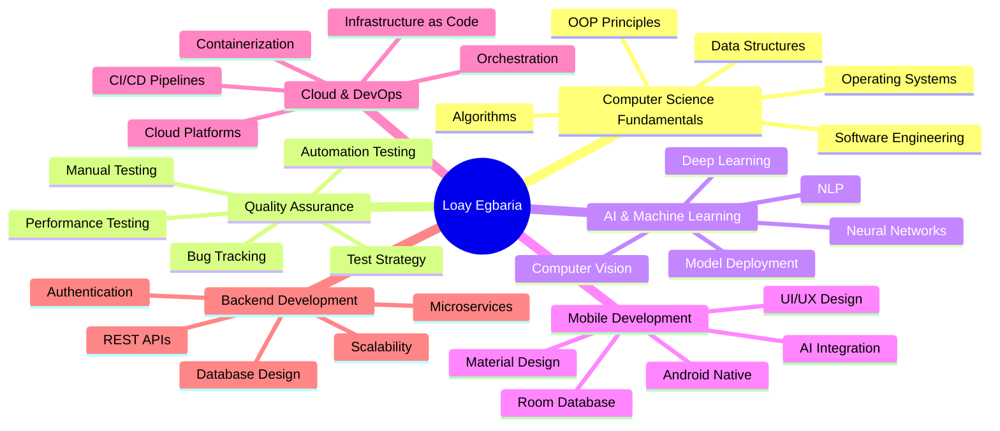

# 👨‍💻 Loay Egbaria

### *Transforming Ideas into Intelligent Solutions* 🚀

## 📖 About Me

I'm a passionate **Computer Science student** at the University of Haifa, specializing in **AI/ML**, **Android Development**, and **Quality Assurance**. My journey in technology is driven by curiosity and a desire to create impactful solutions that bridge the gap between innovative algorithms and real-world applications.

### 🎯 Current Focus
- 🤖 Building AI-powered Android applications with cutting-edge ML models
- 🧪 Developing comprehensive QA automation frameworks
- 📚 Deep diving into Machine Learning and Deep Learning architectures
- 🌐 Exploring cloud-native architectures and microservices
- 🔐 Implementing secure coding practices and DevSecOps principles

### 🌟 Professional Interests
- **Artificial Intelligence & Machine Learning**: Neural networks, NLP, Computer Vision
- **Mobile Development**: Native Android apps with AI integration
- **Quality Engineering**: Test automation, CI/CD pipelines, performance testing
- **Cloud Computing**: Scalable architectures, containerization, orchestration
- **Software Architecture**: Design patterns, system design, clean code principles

### 📫 Get In Touch
- **Email**: Loayegb@gmail.com
- **Location**: Haifa, Israel
- **Availability**: Open to collaborations and opportunities

 

## 🛠️ Technology Arsenal

### 💻 Programming Languages

### 🎨 Frameworks & Libraries

**Backend Frameworks**

**AI/ML Libraries**

### 🗄️ Databases & Storage

### ☁️ Cloud & Infrastructure

### 🔧 DevOps & CI/CD

### 🧪 Testing & QA Tools

### 💻 IDEs & Development Tools

### 🎨 Design Tools

### 🔊 Other Tools & Technologies

## 🎯 Areas of Expertise & Skills

| Domain | Proficiency | Technologies |
|--------|-------------|--------------|
| 🧪 **QA & Testing** |  | Manual Testing, Automation, Test Strategy, Jira, TestRail |
| 🤖 **AI/ML Development** |  | TensorFlow, PyTorch, NLP, Computer Vision, Model Training |
| 📱 **Android Development** |  | Native Android, Room DB, Material Design, MVVM, AI Integration |
| ⚙️ **DevOps & CI/CD** |  | Docker, Kubernetes, Jenkins, Terraform, Cloud Deployment |
| 🌐 **Backend Development** |  | Django, Flask, FastAPI, Spring, RESTful APIs, Microservices |
| 🎨 **Frontend Development** |  | React, HTML5, CSS3, JavaScript, Responsive Design |
| 🗄️ **Database Management** |  | SQL, NoSQL, Query Optimization, Database Design |
| 🔐 **System Design** |  | Architecture Patterns, Scalability, Security, Performance |

## 🚀 Featured Projects & Achievements

### 🎓 Academic Excellence
- 📚 Consistently high academic performance in Computer Science curriculum
- 🏆 Completed advanced courses in AI, Algorithms, Operating Systems, and Software Engineering
- 👨‍🏫 Strong foundation in Object-Oriented Programming and Data Structures

### 💼 Professional Experience
- 🧪 **QA Automation**: Developed comprehensive test automation frameworks
- 📱 **AI Android Apps**: Built intelligent mobile applications with ML integration
- 🔄 **CI/CD Pipelines**: Implemented automated deployment workflows
- 🌐 **Full Stack Projects**: Created end-to-end web applications with modern tech stacks

### 🛠️ Technical Projects
- 🤖 AI-powered Android applications with real-time ML inference
- 🧪 Automated testing frameworks reducing testing time by 60%
- 🌐 Scalable backend services handling thousands of concurrent users
- 📊 Data analysis and visualization projects using Python

## 📚 Knowledge Domains

## 🌐 Connect & Collaborate

I'm always excited to connect with fellow developers, collaborate on innovative projects, and explore new opportunities in tech! Feel free to reach out through any of these platforms:

### 📧 Professional Inquiries
**Email**: Loayegb@gmail.com

### 🤝 Open to:
- 💼 Job Opportunities & Internships
- 🚀 Collaborative Projects
- 💡 Open Source Contributions
- 🎓 Research Collaborations
- 📚 Knowledge Sharing & Mentorship

## 💭 Philosophy & Approach

> *"First, solve the problem. Then, write the code."* – John Johnson

> *"Code is like humor. When you have to explain it, it's bad."* – Cory House

> *"The only way to learn a new programming language is by writing programs in it."* – Dennis Ritchie

### My Development Principles

🎯 **Quality First**: Write clean, maintainable, and testable code  
🔄 **Continuous Learning**: Stay updated with latest technologies and best practices  
🤝 **Collaboration**: Believe in the power of teamwork and knowledge sharing  
🚀 **Innovation**: Always looking for creative solutions to complex problems  
📊 **Data-Driven**: Make decisions based on metrics and evidence  
🔒 **Security-Minded**: Implement security best practices from day one

## 🎓 Continuous Learning Journey

I believe in lifelong learning and constantly expanding my skill set. Currently exploring:

🔬 **Advanced Machine Learning**: Transformer architectures, Reinforcement Learning  
☁️ **Cloud Architecture**: Multi-cloud strategies, Serverless computing  
🔐 **Cybersecurity**: Secure coding, Penetration testing, DevSecOps  
📊 **Data Engineering**: Big Data technologies, ETL pipelines, Data warehousing  
🎮 **Game Development**: Unity, Game design patterns, AR/VR  

### 💫 Fun Fact
When I'm not coding, you can find me exploring the latest AI research papers, contributing to open-source projects, or experimenting with new technologies!

### 📊 Profile Statistics

### 🌟 Thank You for Visiting!

*If you find my work interesting, consider giving a ⭐️ to my repositories!*

**Let's build something amazing together!** 🚀

